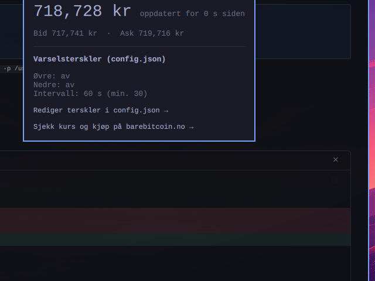

# Bare Bitcoin Prisvarsel — Omarchy-plugin

Viser den aktuelle BTC-prisen i NOK hos [Bare Bitcoin](https://barebitcoin.no)
rett i Omarchy-linja, og varsler deg med et desktop-varsel når prisen krysser
en terskel du selv setter.

**Plugin-id:** `io.github.katla50.barebitcoin`

## Hva den gjør — og ikke gjør



- ✅ Henter BTC/NOK-prisen fra Bare Bitcoins **offentlige** prisendepunkt:
  `GET https://api.bb.no/v1/price/nok` (ingen autentisering, se
  [API-dokumentasjonen](https://dev.barebitcoin.no/api/openapi))
- ✅ Viser prisen som et bar-widget (pill) med klikkbart detaljpanel
  (pris, bid/ask, aktive terskler)
- ✅ Sender desktop-varsel (`notify-send`) når prisen krysser din øvre eller
  nedre terskel — varselet fyres én gang per krysning og aktiveres på nytt
  når prisen er tilbake i det nøytrale båndet
- ❌ Ingen handel, ingen ordrer, ingen uttak
- ❌ Ingen API-nøkkel eller konto kreves
- ❌ Ingen POST-forespørsler mot Bare Bitcoin — pluginen er 100 % read-only

## Forutsetninger

- Omarchy med Quattro-shell og plugin-støtte
- `curl`, `jq`, `gawk`/`awk`, `coreutils` (`numfmt`) og `libnotify` (`notify-send`)

## Installasjon

```sh
omarchy plugin add https://github.com/katla50/barebitcoin-omarchy --enable
# eller: omarchy plugin install <samme URL>
```

## Konfigurasjon

Terskler og pollintervall styres fra
`~/.config/barebitcoin-plugin/config.json` (opprettes med standardverdier
ved første kjøring; midtklikk på pillen åpner fila):

```json
{
  "upper_threshold_nok": 1200000,
  "lower_threshold_nok": 900000,
  "poll_interval_seconds": 60
}
```

- Sett en terskel til `null` for å deaktivere den.
- Minimum pollintervall er 30 sekunder — lavere verdier heves til 30.
- Endringer tas i bruk ved neste poll, uten omstart av skallet.

Selve widgetens utseende (kompakt visning, bid/ask i panelet, ikon) justeres
i `~/.config/omarchy/shell.json` via manifestets `barWidget`-skjema.

## Avinstallasjon

```sh
omarchy plugin remove io.github.katla50.barebitcoin
```

Pluginen rører bare sitt eget plugin-område samt
`~/.config/barebitcoin-plugin/` (config + varseltilstand). Sistnevnte er
dine egne data og fjernes derfor ikke automatisk — slett mappa manuelt om du
vil ha alt borte:

```sh
rm -rf ~/.config/barebitcoin-plugin
```

## Feilsøking

- **Ingen pris?** Test endepunktet direkte:
  `curl -s https://api.bb.no/v1/price/nok` — forventet svar:
  `{"price":718839.94,"bid":…,"ask":…,"timestamp":…}`
- **Ingen varsler?** Test varslene: `notify-send "Test" "Varsler virker"`
- **Se hva helperen gjør:** kjør
  `sh ~/.config/omarchy/plugins/io.github.katla50.barebitcoin/price-watch.sh ~/.config/barebitcoin-plugin`
  i en terminal — den skriver én JSON-linje per poll.
- **QML-feil:** `qs log -p ~/.local/share/omarchy/shell --tail 100 | grep barebitcoin`

## Lisens

MIT — se [LICENSE](LICENSE).
